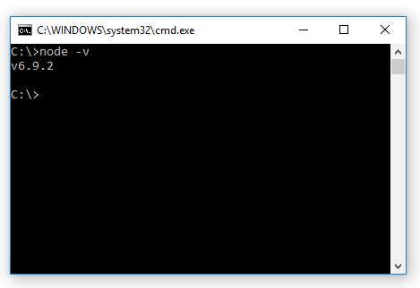

## Configuração do ambiente de desenvolvimento

### Windows

#### Visual Studio

Faça download do Visual Studio para windows [clicando aqui](https://code.visualstudio.com/).

Tutorial detalhado de como instalar o vscode: [Tutorial DevMedia](https://www.devmedia.com.br/introducao-ao-visual-studio-code/34418)

##### Extensões do VSCode

Os complementos nesta IDE são mais que recursos extras, elas conseguem ajudar o desenvolvedor a criar seus códigos em praticamente qualquer linguagem e isso, por si só, já é algo importante.

Para ativar e instalar uma nova extensão, basta clicar no último ícone da barra lateral de ferramentas do Visual Studio Code. Será mostrado inicialmente as extensões mais populares. Para instalar, é só escolher a extensão, verificar sua documentação básica e clicar no botão “Install” ou "Instalar". Depois disso é só começar a utilizar o novo recurso.

Extensões recomendadas:
1. ESLint
2. ES7 React/Redux/React-Native/JS snippets
3. prisma.vscode-graphql


#### Instalação do NodeJS
Faça download do NodeJS para windows [clicando aqui](https://nodejs.org/en/download/current).

Escolha o instalador para a sua plataforma (Sistema Operacional) e arquitetura do processador (32-bits ou 64-bits).

Ao clicar no link do seu instalador, escolha a pasta para onde o download será feito (caso seu navegador já não baixe para a pasta padrão /downloads).

Depois basta clicar duas vezes no arquivo baixado e seguir os passos dados na janela de instalação. Por padrão, você não precisa alterar nada: apenas siga clicando em “Next”.

Pronto, o Node está instalado na sua máquina. Para conferir a versão, abra uma janela de comandos (clique em “iniciar”, digite “cmd” e depois clique no item “Prompt de Comando”) e digite node -v



##### Instalando o yarn

Abra o terminal e digite: 
```
npm install -g yarn
```

##### Instalando create-react-app

Abra o terminal e digite:

```
yarn global add create-react-app
```

ou, se não funcionar:

```
npm install -g create-react-app
```


#### Cmder

Para uma melhor experiência de desenvolvimento no windows, necessitamos de um emulador de terminal.
Baixe a última versão em: https://github.com/cmderdev/cmder/releases/download/v1.3.11/cmder.zip

Recomendo que extraia o arquivo zip no C:\cmder

##### Integrando o cmder no vscode

1. Pressione "Ctrl" + "," para acessar as contigurações do vscode
2. Pesquise por settings.json
3. Clique em "Edit in settings.json" ou "Editar em settings.json"
4. Adicione ou modifique as seguintes variáveis no arquivo de configuração e substitua todos os ` [cmder_root] ` abaixo com o seu diretório de instalação do cmder. Se você extraiu o cmder no C:\cmder, seu diretório de instalação será: ` C:\\cmder `:

```json
  "terminal.integrated.shell.windows": "cmd.exe",

  "terminal.integrated.env.windows": {
  "CMDER_ROOT": "[cmder_root]"
  },
  "terminal.integrated.shellArgs.windows": [
    "/k [cmder_root]\\vendor\\init.bat"
  ],
```

Fonte: https://github.com/cmderdev/cmder/wiki/Seamless-VS-Code-Integration

Qualquer dúvida: mihael.zaminsousa@gmail.com
