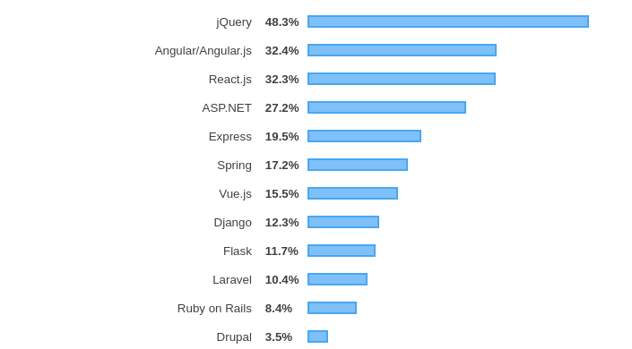
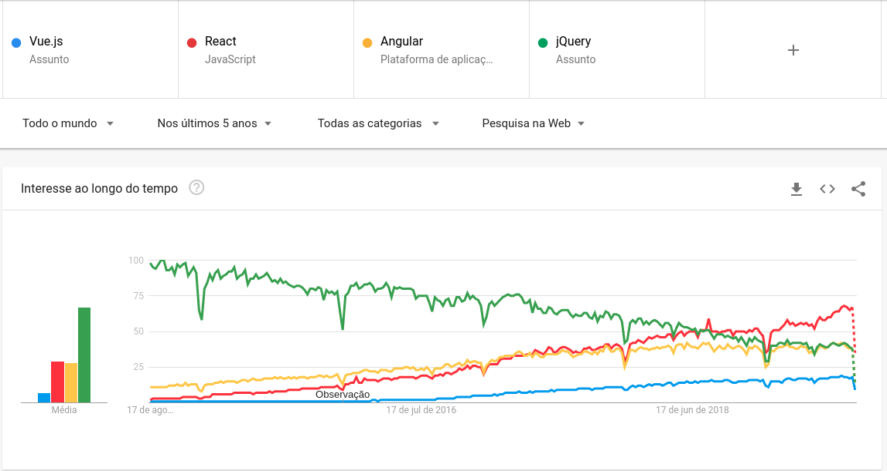
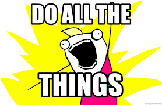
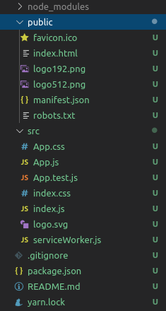
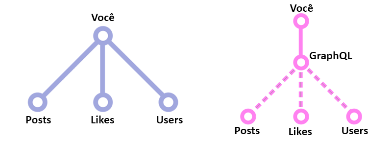

<!-- class: invert -->


# Desenvolvendo WebApps com ReactJS e GraphQL

Mihael Zamin Sousa - Engenharia de Computação - UFSC

---
<!-- class: default -->

# O que é o React

React.js é uma biblioteca de Javascript para desenvolver Interface com o usuário. Inicialmente criado pelo Instagram, o ReactJS teve seu código aberto pelo Facebook após a compra da empresa.

É atualmente é a biblioteca Javascript mais procurada no mercado de trabalho na área de desenvolvimento front-end e desenvolvimento full-stack.

Uma das principais vantagens do React é a possibilidade de criar aplicações nativas para mobile utilizando o **React Native**.

---

# Estatísticas interessantes sobre o ReactJS

Segundo as estatísticas da pesquisa de 2019 do Stack Overflow os Web Frameworks mais utilizados por profissionais, são:



---

Dos web Frameworks listados, quatro merecem destaque:

- jQuery
- React.js
- Vue.js
- Angular

---

# React no Google Trends



---

# Quem utiliza o React

         

---

<!-- class: invert-->

# Antes de começarmos...

>Fundamentos de JavaScript ES6/ES7.

---
<!-- class: -->

# Definição de DOM

**DOM** é a representação dos compomentes na página. Você manipula o **DOM** a fim de manipular estes componentes (criar, recriar, alterar seu **estado**).

---

# Virtual DOM

>Virtual DOM é um framework para manipulação do DOM.

Virtual DOM oferece três recursos:

- Uma representação do DOM real na linguagem JavaScript. O DOM real é então gerado a partir desta representação.
- Computação das diferenças entre o DOM real e a sua representação.
- Aplicação de patch para atualizar o DOM real conforme o novo estado da sua representação.

---

# Declaração de Variáveis

Constantes:

 ```javascript
const varname = {} 
```

Declaração usando let:

 ```javascript
let varname;
```

Declaração usando var:

 ```javascript
var varname;
```

---

# Declaração de Funções ES5

Forma padrão

 ```javascript
function soma(a, b){
    return a + b;
}
```

Usando closures

 ```javascript
const soma = function (a, b){
    return a + b;
}
```

---

# Declaração de Funções ES6

ES6 Arrow Function

 ```javascript
const soma = (a,b) => {
    return a+b;
}
```

ES6 com return implícito

 ```javascript
const soma = (a,b) => a+b;
```

---

# Percorrendo arrays e objetos com `map()`

**Use `map()` quando:** é preciso traduzir/mapear todos os elementos em um array para outro conjunto de valores.

Exemplo: converter temperatura de Fahrenheit para Celsius.

```javascript
const fahrenheit = [ 0, 32, 45, 50, 75, 80, 99, 120 ];

const celsius = fahrenheit.map( elem => {
    return Math.round( ( elem - 32 ) * 5 / 9 );
});

// ES6
// fahrenheit.map( elem => Math.round( ( elem - 32 ) * 5 / 9 ) );

```

---

# Percorrendo arrays e objetos com `filter()`

**Use `filter()` quando:** é preciso remover elementos indesejados com base em alguma(s) condição(ões).

Exemplo: remover elementos duplicados de um array.

```javascript
const arr = [1,1,2,2,3,4,7,88,9,9,10,88];

const uniqueArray = arr.filter( function (elem, index, array ) {
    return array.indexOf( elem ) === index;
} );

// ES6
// arr.filter( ( elem, index, arr ) => arr.indexOf( elem ) === index );

```

---

# Percorrendo arrays e objetos com `reduce()`

**Use `reduce()` quando:** é preciso encontrar um valor cumulativo ou concatenado com base em elementos de todo o array.

Exemplo: soma de lançamentos de foguetes orbitais no período de 1 ano.

```javascript
var rockets = [
    { country:'Russia', launches:32 },
    { country:'US', launches:23 },
    { country:'China', launches:16 },
];

const sum = rockets.reduce( function( prevVal, elem ) {
    return prevVal + elem.launches;
}, 0 );

// ES6
// rockets.reduce( ( prevVal, elem ) => prevVal + elem.launches, 0 );

```

---

# Juntando tudo

```javascript
function menorValor(vetor){
    //com retorno implícito
    const retornaMenor = (a,b) => a < b ? a : b;
    var menor = vetor[0];
    //percorrendo vetor utilizando uma Arrow Function
    vetor.forEach((e)=>{
        menor = retornaMenor(menor, e);
    });
    return menor;
}
```

---

# Desestruturação de objetos

A sintaxe de atribuição via desestruturação (destructuring assignment) é uma expressão JavaScript que possibilita extrair dados de arrays ou objetos em variáveis distintas.

---

## Exemplo

```javascript
const numbers = {a: 1, b : 2};
console.log(numbers.a) //1
console.log(numbers.b) //2
```

```javascript
const numbers = {a: 1, b : 2};
var {a, b} = numbers;
console.log(a); //1
console.log(b); //2
```

```javascript
const numbers = {a: 1, b : 2, c: 3, d:4};
var numbersCopy = {a: 5, ...numbers};
console.log(numbersCopy.a); //5
console.log(numbersCopy.b); //2
console.log(numbersCopy.c); //3
console.log(numbersCopy.d); //4
```

---

# Importando e exportando

Na Orientação a Objetos, possuimos modificadores de acesso como `private`, `public` e `protected`. Já no paradigma funcional em javascript, isso é feito por meio de importação e exportação.

---

# Import

Sintaxe CommonsJS

```javascript
const React = require('react);
```

```javascript
const {useEffect, useState} = require('react');
```

Sintaxe ES6:

```javascript
import React from "react";
```

```javascript
import {useEffect, useState} from "react";
```

---

# Export

Sintaxe CommonsJS

```javascript
module.exports = {useEffect, useState}
```

Sintaxe ES6:

```javascript
const useState = () => {};
export useState;
export const useEffect = () => {};

```

Exportação default ES6:

```javascript
const react = () => {};
export default react;
```

---


# <!-- fit --> MÃO NA MASSA


---

<!-- class: invert-->
# <!-- fit --> Criando o primeiro app

>Utilizando create-react-app


---
<!-- class: default-->

# Formas de criar um App React

Basicamente, existem 4 formas mais utilizadas de criar um app com React:

- **create-react-app**
- NextJS (create-next-app)
- GatsbyJS (Gerador de páginas estáticas)
- React Native (Mobile)

---

# Criando e rodando o seu primeiro app

1. Crie uma pasta para o nosso projeto;
2. Abra a pasta no VSCode;
3. Clique em Terminal > New Terminal (Terminal > Novo Terminal);
4. No terminal digite `create-react-app <nome_do_app>` ou `npx create-react-app <nome_do_app>` substituindo `<nome_do_app>` pelo nome que desejar dar ao nosso app. (Sugestão de nome: `app`);
5. Navegue até a pasta pelo terminal usando `cd <nome_do_app>`;
6. Digite no terminal `yarn run start` ou `npm run start`;
7. Abra o browser de sua preferência no endereço `http://localhost:3000`.

---

# <!-- fit --> Estrutura inicial do create-react-app



---
<!-- class: invert-->
# <!-- fit --> Conceitos iniciais do React.js

>Componentização, propriedades e estados


---
<!-- class: default-->

# Componentização

A principal diferença do React e de outras bibliotecas baseadas em componentes diante de libs como o jQuery, Angular 1 ou Javascript puro está em sua habilidade de separar as funcionalidades do software em componentes, mas o que são componentes?

>Componentes são conjuntos isolados de lógica (Javascript), visualização (JSX/HTML) e possível estilização (CSS).

---

# Por que componentes?

Imagine a timeline do Facebook, você roda a barra de rolagem até conter 500 posts em tela e então adiciona um comentário ao post de nº 250, imagine o quão trabalhoso é para a DOM do seu navegador entender que um único elemento no meio de tantos foi atualizado e enviar essa informação em tempo-real para os outros usuários do Facebook, ou até ouvir a atualização de 500 posts em tela de forma organizada, imagine controlar tudo isso com jQuery ou Javascript puro, **será que é possível?**

---

# As faces de um componente: Utilizando classes

```javascript
import React from "react";

class Post extends React.Component {
    ...
}
```

---

# As faces de um componente: Utilizando função

## Arrow Function

```javascript
import React from "react";

const Post = () => {
    ...
}
```

## Function (Recomendado)

```javascript
import React from "react";

function Post() {
    ...
}
```

---

# Propriedades


Assim como no HTML, podemos repassar propriedades nas notações dos nossos componentes e acessá-las de forma muito rápida.

```javascript
import React from "react";
function Post({title, thumbnail, children}){
    return (
      <h1>{title}</h1>
        
      <p>{children}</p>
    );
}
export default Post;
```

---

```javascript
import React from "react";
import Post from "./Post";

function App(){
    return (
      <Post title = "Lorem ipsum dolor sit amet" 
            thumbnail="https://placeimg.com/640/480/any">
        Mussum Ipsum, cacilds vidis litro abertis. 
        Nullam a nisl ut ante blandit hendrerit. 
        Aenean sit amet nisi. 
        Mais vale um bebadis conhecidiss, 
        que um alcoolatra anonimis.
      </Post>
    );
}

```

---

# Estados

Diferente das propriedades, o estado não é repassado ao componente e sim configurado dentro dele. Pense no estado como as propriedades internas que devem ser armazenadas para renderizarmos o componente da forma correta.

O estado de uma aplicação nada mais é que as informações armazenadas no nosso programa em um determinado tempo.

---

# Estados usando hooks

```javascript
import React, {useState} from "react";
import Post from "../Post";

function ListaDePosts(){
    const [posts, setPosts] = useState([{
        title: "Lorem ipsum dolor sit amet",
        content: "Mussum Ipsum, cacilds vidis litro abertis."
        thumbnail: "https://placeimg.com/640/480/any"}])
    return (
        {posts.map(e=>(<Post title={e.title}
                             thumbnail={e.thumbnail}>
                             {content}
                             </Post>))}
        );
}
export default ListaDePosts
```
---

# Efeitos colaterais com React Hooks

Um "efeito colaretal" é qualquer coisa que causa a mudança de outros estados da aplicação.
Por exemplo: toda vez que são adicionados novos posts, há a necessidade de recalcular a quantidade de páginas.

---

# Estilização de componentes no react

Para estilizar componentes no react, é possível utilizar scss, css, sass ou até mesmo a biblioteca **styled-components**.
Também é possível integrar o seu framework css favorito como: `bootstrap`, `bulma`, `material-ui`, `materialize`. Tudo isso utilizando `yarn` ou `npm`

---

# Multi Page Application

Também é possível criar multi page applications com o react-router.

```jsx
<Switch>
    <Route exact path="/" component={Posts} />
    <Route path="/posts" component={Posts} />
    <Route path="/post/:postId" component={Post} />
</Switch>
```

---

# Consumindo dados

Para manipular e exibir dados no React, é necessário que haja um webservice para ser consumido. O react tem suporte a vários tipos de webservices. Os mais utilizados hoje em dia são as baseadas em json como: RestFul e **GraphQL**

---
<!--class: invert--->
# Criando uma GraphQL API


---
<!--class: default--->

# O que é API?

O acrônimo API que provém do inglês Application Programming Interface (Em português, significa Interface de Programação de Aplicações), trata-se de um conjunto de rotinas e padrões estabelecidos e documentados por uma aplicação A, para que outras aplicações consigam utilizar as funcionalidades desta aplicação A, sem precisar conhecer detalhes da implementação do software.

Desta forma, entendemos que as APIs permitem uma interoperabilidade entre aplicações. Em outras palavras, a comunicação entre aplicações e entre os usuários.

---

# Exemplo de uma API utilizando Rest

[JSON Placeholder](https://jsonplaceholder.typicode.com/)

---

# O nascimento do GraphQL

O GraphQL começou no Facebook. Imagine que para exibir uma lista de posts era necessário o acesso a uma API, e dentro de cada post tinha que vir uma lista dos usuários que curtiram. Dentro de cada objeto de usuário tem que vir o nome, foto do perfil, link para o perfil, se o usuário já é seu amigo, etc.

---

# O GraphQL entra em cena



Ao invés de ter que ficar criando uma API para cada estrutura diferente de dados e/ou ficar manualmente fazendo consultas para cada banco e depois juntar os dados, que tal simplesmente dizer a “alguém” o que você precisa?

---

Para obter todos os posts e usuários, teríamos que naturalmente fazer duas requisições http com rest:

```http
GET /posts
GET /users
```

---

Com graphql, precisariamos somente de uma única consulta do tipo:

```graphql
query {
   posts {
      likes
      comments
      shares
   }
   users {
      id
      name
      profile
   }
}
```

---

# Conceitos Básicos de GraphQL

[Learn GraphQL](https://graphql.org/learn/)

- Schema
- Type System
- Queries e Mutations

---

# Schema

Para que as consultam funcionem, o GraphQL necessita da criação de um Schema, especificando os tipos de dados que podem existir. O processo é análogo à criação das tabelas de um banco de dados relacional.

---

# Queries e Mutations

Na espeficiação do GraphQL possuimos trẽs tipos de campos na raiz do schema:

- Subscription
- **Query**
- **Mutation**

Subscription é um recurso para atualizações em tempo real.
Queries são consultas que não efetuam alterações nos dados.
Mutation são consultas que realizam mudanças (mutações) nos dados.

---

# Definindo o schema

O GraphQL possui na sua especificação os seguintes tipos de dados:

- `Int`
- `Float`
- `String`
- `Boolean`
- `ID`: O tipo escalar ID representa um identificador exclusivo, geralmente usado para refazer um objeto ou como a chave de um cache. O tipo ID é serializado da mesma maneira que uma String; no entanto, defini-lo como um ID significa que ele não se destina a ser legível por humanos.

---

# Exemplo de definição de Schema

```graphql
type Comment{
    id: ID!
    content: String
}
type Post{
    title: String!
    comments: [Comment]!
}
```

```graphql
schema{
    query{
        posts(title: String): [Post]
        comments(post: ID): [Comment]
    }
}
```

---

# Criando um servidor grahql

```graphql
const { ApolloServer, gql } = require('apollo-server');

// This is a (sample) collection of books we'll be able to query
// the GraphQL server for.  A more complete example might fetch
// from an existing data source like a REST API or database.
const books = [
  {
    title: 'Harry Potter and the Chamber of Secrets',
    author: 'J.K. Rowling',
  },
  {
    title: 'Jurassic Park',
    author: 'Michael Crichton',
  },
];
```

---

```graphql
// Type definitions define the "shape" of your data and specify
// which ways the data can be fetched from the GraphQL server.
const typeDefs = gql`
  # Comments in GraphQL are defined with the hash (#) symbol.

  # This "Book" type can be used in other type declarations.
  type Book {
    title: String
    author: String
  }

  # The "Query" type is the root of all GraphQL queries.
  # (A "Mutation" type will be covered later on.)
  type Query {
    books: [Book]
  }
`;

```

---

```graphql
// Resolvers define the technique for fetching the types in the
// schema.  We'll retrieve books from the "books" array above.
const resolvers = {
  Query: {
    books: () => books,
  },
};

// In the most basic sense, the ApolloServer can be started
// by passing type definitions (typeDefs) and the resolvers
// responsible for fetching the data for those types.
const server = new ApolloServer({ typeDefs, resolvers });

// This `listen` method launches a web-server.  Existing apps
// can utilize middleware options, which we'll discuss later.
server.listen().then(({ url }) => {
  console.log(`🚀  Server ready at ${url}`);
});

```

---

# Integrando Com React

[Apollo Docs](https://www.apollographql.com/docs/react/)